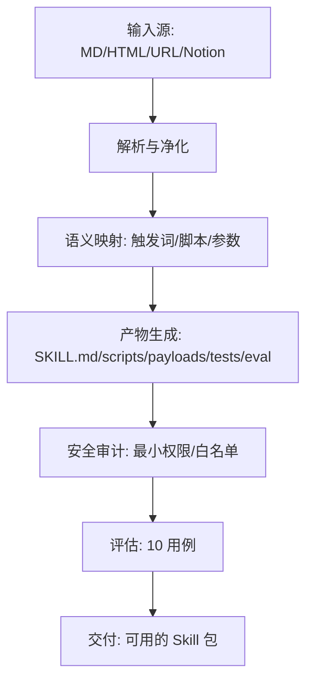

# Doc2Skill OpenSpec v0.1

## 概述
Doc2Skill 是一个从多源文档（Markdown/HTML/URL/Notion 导出）快速生成可用 Claude Skill 包（SKILL.md、scripts/、payloads/、tests/、eval/）的工具，强调最小权限、安全可控与可评估。

参考资料：原始资料/AI Skills 互操作性架构设计.md

## 目标与范围
- 将文档章节与代码片段自动映射为技能触发词与受控脚本模板。
- 自动生成 .trae/rules（路由与白名单、参数校验、交互确认）。
- 输出完整的 Skill 包结构与评估用例（至少 10 条）。
- 提供审计能力（最小权限、参数白名单、路径约束）。

## 架构


## 输入源支持
- Markdown/HTML：markdown-it-py + BeautifulSoup
- URL：requests + readability-lxml（正文抽取）
- Notion 导出：解析 .md/.csv，映射属性为 payload

## 核心模块
- Parser：统一解析文档结构与代码块
- Mapper：章节→触发词；代码块→脚本模板；参数说明→payload 模板
- Generator：生成 SKILL.md、scripts/、payloads/、tests/、eval/
- RulesBuilder：生成 .trae/rules，包含路由、白名单、确认提示
- Auditor：扫描权限与参数，拒绝 Bash(*)，仅允许受控 Python 白名单脚本
- Evaluator：执行 10 条场景用例，统计通过率与误匹配率
- CLI：convert/audit/eval 三类子命令

## 安全策略
- 最小权限：仅允许必要工具；默认禁止任意 Bash/PowerShell
- 白名单脚本：例如 Notion create 脚本仅允许 --token、--payload-file
- 参数校验：JSON Schema 校验 payload；拒绝未知参数
- 路径约束：工作区与 payloads/、artifacts/ 等受控目录
- 交互确认：展示将执行的命令与 payload 路径，用户确认后执行

## CLI 设计
- doc2skill convert <input> -o <skill_dir> [--proxy]
  - 功能：从输入源生成 Skill 包与 .trae/rules
- doc2skill audit <skill_dir>
  - 功能：审计白名单、参数、路径与权限
- doc2skill eval <skill_dir>
  - 功能：运行评估用例（模拟路由与执行），输出报告

## 数据与文件模型
- SKILL.md：技能说明与触发词列表
- scripts/：受控 Python 脚本模板（白名单）
- payloads/：JSON 模板（含 Schema）
- tests/：Pytests 或 JSON 用例定义
- eval/：评估场景与期望结果
- .trae/rules：规则与路由、白名单、参数校验、确认提示

## 产物结构示例
```
skill_dir/
  SKILL.md
  scripts/
  payloads/
  tests/
  eval/
  .trae/rules/project_rules.md
```

## 评估指标与 10 条用例
指标：
- 10 用例通过率 ≥ 80%
- 误匹配率 < 5%
- 审计报告无高危项（如 Bash(*)）

用例（输入 → 期望）：
1. md_to_skill_minimal → 生成 SKILL.md + 2 payload + scripts + 5 tests 成功
2. html_to_skill_readonly → allowed-tools 仅 Read/Grep，无 Bash
3. url_to_skill_with_proxy → 抓取成功并提示设置 HTTP_PROXY/HTTPS_PROXY
4. notion_export_to_skill → 字段映射到 payload 模板，生成脚本与触发词
5. audit_reject_wildcard_bash → 审计失败并给出修复建议
6. section_to_triggerwords → 标题与小节被正确映射为触发词
7. codeblock_to_scripts → 代码块被转为受控 Python 脚本模板
8. param_to_payload_schema → 参数说明生成 JSON Schema 并校验通过
9. rules_confirmation_flow → 规则生成含确认提示与白名单参数校验
10. eval_report_generation → 输出评估报告（通过率、误匹配率）

## 实施阶段
- M1：基础解析/映射/生成；5 用例通过
- M2：审计与评估完善；10 用例通过；文档与示例补全