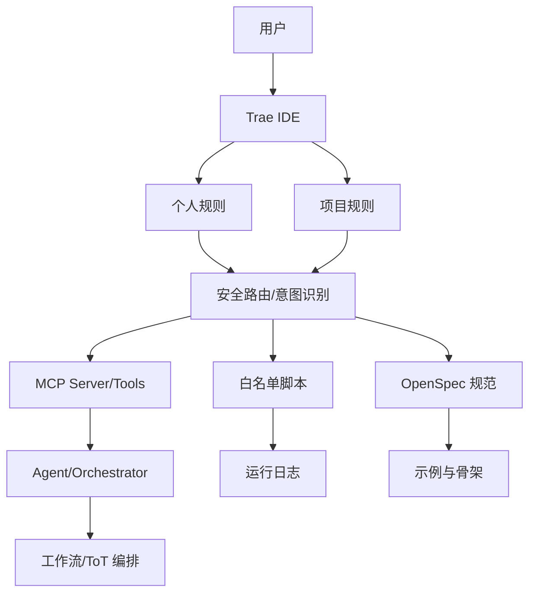
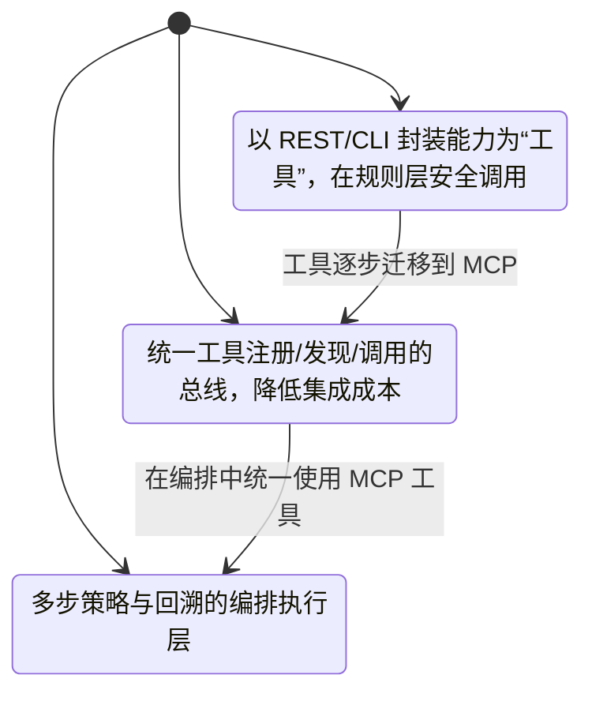
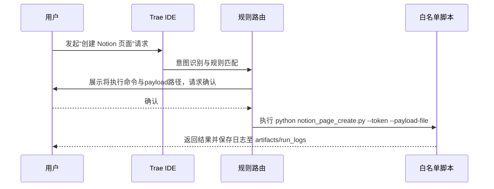

# Trae-skills OpenSpec 规范草案

版本：v0.1.0
状态：草案（Draft）
范围：在 Trae IDE 中通过【个人规则】+【项目规则】集成 OpenSpec 与 MCP，实现标准化工作区初始化、零命令操作与安全路由。

## 1. 项目目标
- 将“技能（skills）”定义为针对特定项目的标准化方法与配套工具集合（规范+实现+评估）。
- 在 Trae IDE 中以规则驱动的方式，零命令完成项目初始化与操作。
- 集成互操作性三模式：API-as-Tool、MCP-as-Bus、Agent-as-Orchestrator。
- 强化安全：白名单脚本、参数校验、显式确认、日志审计。

## 2. 体系结构（Architecture）
### 2.1 总览图（Mermaid，暗黑主题可读）

### 2.2 模块说明
- 个人规则（Personal Rules）：用户级路由与安全约束（示例：Notion Skill 白名单）。
- 项目规则（Project Rules）：项目内的操作策略与目录约定（OpenSpec、MCP、examples）。
- 安全路由（Router）：将用户意图映射到白名单操作，执行前显示命令与参数，需用户确认。
- OpenSpec：以可读可执行的规范文件描述架构、接口、评估与里程碑。
- MCP：工具总线统一注册与调用，便于标准化集成。
- Agent/Orchestrator：具备多步策略（ToT）与回溯能力的编排层。
- 日志审计：所有受控命令通过 Tee-Object 保存输出到 artifacts/run_logs。

## 3. 互操作性（Interoperability）
### 3.1 模式对比（Mermaid 状态图）

### 3.2 决策建议
- 简单调用优先 API-as-Tool，快速封装与上线。
- 多工具协同优先 MCP-as-Bus，降低耦合与维护成本。
- 复杂流程与策略优先 Agent-as-Orchestrator，确保可观察与回溯。

## 4. CLI 与安全（以 Notion Skill 为例）
- 仅允许脚本：
  - SkillGen-MVP/scripts/notion_page_create.py
  - SkillGen-MVP/scripts/notion_db_create.py
- 仅允许参数：`--token`、`--payload-file`
- Token 来源：环境变量 NOTION_TOKEN 或显式传参
- 代理（Windows + Clash）：
  - `$env:HTTP_PROXY = "http://127.0.0.1:7890"`
  - `$env:HTTPS_PROXY = "http://127.0.0.1:7890"`
- 日志保存（PowerShell）：
  - `python ... | Tee-Object -FilePath artifacts\run_logs\notion_$(Get-Date -Format "yyyyMMdd_HHmmss").json`
- 拒绝条件：非白名单脚本、未知参数、未设置 NOTION_TOKEN、写入非指定目录。

### 4.1 交互序列（确认执行）

## 5. 评估与审计（10 用例）
以下用例用于验证规则驱动与安全路由的正确性：
1) 创建页面：提供有效 `database_id` 与属性 + 有效 NOTION_TOKEN → 成功，返回页面ID，日志保存。
2) 创建数据库：提供有效 `parent page_id` + 有效 NOTION_TOKEN → 成功，返回数据库ID，日志保存。
3) 缺失 token：未配置 NOTION_TOKEN 且未传 `--token` → 拒绝执行并提示修正。
4) 非白名单脚本：请求执行未知脚本 → 拒绝并提示使用白名单脚本。
5) 未知参数：传入非允许参数 → 拒绝并提示仅允许 `--token`、`--payload-file`。
6) payload 文件缺失：路径不存在 → 拒绝并提示修正路径。
7) 代理未设置且外网受限：提示设置 HTTP_PROXY/HTTPS_PROXY 后重试。
8) 用户取消确认：在展示命令后拒绝执行 → 不执行且记录取消。
9) 日志目录不存在：提示创建 artifacts/run_logs 目录后再执行。
10) 写入非指定目录：尝试写入除 payloads/ 与 artifacts/ 外目录 → 拒绝并提示规则。

## 6. 目录规范
- Trae-skills/
  - openspec/specs/spec.md（本规范）
  - openspec/specs/tasks.md（任务清单）
  - docs/（调研与记录）
  - mcp/（MCP 工具与最小 server 示例）
  - rules/（Trae 个人/项目规则模板与说明）
  - examples/（最小可运行示例）

## 7. 里程碑（M1/M2）
- M1：完成规则模板、规范草案与最小目录结构；10 用例通过“静态”审查。
- M2：接入最小 MCP server 与一个白名单脚本（Notion），完成实际运行与日志审计。

## 8. 参考链接
- Trae IDE：https://docs.trae.ai/ide/what-is-trae?_lang=zh
- 参考项目：https://github.com/leon30083/trae-openspec-mcp
- MCP 规范与示例：https://modelcontextprotocol.io/